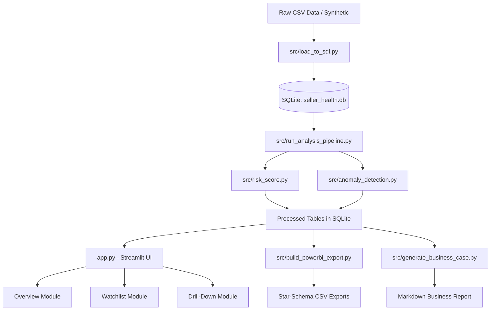

# SellerHealth Watchlist

A lightweight, explainable seller-performance monitoring system for e-commerce
marketplaces — built on the Olist Brazilian E-Commerce dataset schema, sliced
to seller level. SQL aggregation → transparent weighted risk score → rolling
anomaly detection → an interactive dashboard → clean Power BI exports.

Built as a portfolio project for Business Analyst roles (marketplace / seller
operations focus).

**Live app:** _add your Streamlit Cloud URL here after deploying (see below)_
**Repo:** https://github.com/thedikshantmahlawat/sellerhealth-watchlist

---

## Problem Statement

On any marketplace, a small share of sellers drives a disproportionate share
of late shipments, cancellations, and refund/CS cost — but without a
systematic way to score and rank sellers, that concentration is invisible
until it shows up in complaint volume or churn. This project builds a
**simple, fully explainable** early-warning system: a composite risk score an
ops manager can audit line by line, plus an anomaly flag for sellers who
break down suddenly rather than gradually — deliberately *not* a black-box
model, since a coaching program needs a score people will trust.

## Architecture Diagram



## ⚠️ A note on the data

This project was built in a sandboxed environment with no internet access,
so the real Kaggle dataset ("Brazilian E-Commerce Public Dataset by Olist")
could not be downloaded here. `src/generate_synthetic_data.py` generates data
that matches its schema **exactly** — same filenames, same columns, same
`order_status` values — with four deliberately-injected seller behavior
patterns (healthy / chronically poor / suddenly-deteriorating / small-and-volatile)
so the risk score and anomaly detector have something real to catch.

**To use the real dataset:** download it from Kaggle, drop the CSVs into
`data/raw/` (same filenames), and re-run `python src/load_to_sql.py`. Nothing
else changes — no script downstream hardcodes a year, a row count, or a
seller count.

## Risk Score Methodology

Every seller-month gets a score from **0 (healthy) to 100 (highest risk)**,
built from four components, each scored *relative to that month's other
sellers* (so a marketplace-wide event doesn't automatically flag everyone):

| Signal | Weight | Why |
|---|---|---|
| Late shipment rate | 35% | Biggest driver of CS tickets/refunds; fully within seller control |
| Cancellation rate | 30% | Direct lost revenue + refund cost; usually a stock-accuracy issue |
| Review score (inverted) | 25% | Real signal, but lagging and blended with product quality — weighted third |
| Order volume decline | 10% | Early-warning sign, but volume swings also have benign causes (seasonality) |

No machine learning, no fitted coefficients — every weight is a business
judgment call stated above, and every component is a one-line explanation.
Full formula: `src/risk_score.py`.

**Anomaly flag** is a separate signal: it compares a seller's current score
to their *own* recent trailing average (not a fixed cutoff), so a seller who
was fine for a year and just broke down gets caught early — not only after
it's chronic. Full method + the reasoning behind the pooled-std correction
that fixed an early over-flagging bug: `src/anomaly_detection.py`.

## How to Run Locally

```bash
git clone https://github.com/thedikshantmahlawat/sellerhealth-watchlist.git
cd sellerhealth-watchlist
python -m venv venv && source venv/bin/activate   # Windows: venv\Scripts\activate
pip install -r requirements.txt

# Data + SQL + analysis pipeline (skip if data/processed/ is already populated)
python src/generate_synthetic_data.py     # or drop in the real Kaggle CSVs instead
python src/load_to_sql.py
python src/run_analysis_pipeline.py
python src/build_powerbi_export.py
python src/generate_business_case.py

streamlit run app.py
```

## Deploying on Streamlit Cloud

1. Push this repo to GitHub (see below).
2. Go to **share.streamlit.io** and sign in / connect your GitHub account.
3. Click **Create app** → choose this repository, branch `main`, file path
   `app.py`.
4. Click **Deploy**. First boot takes a few minutes; `app.py` will
   auto-build the database from `data/raw/` if it isn't already committed.
5. Optional: set a custom subdomain under the app's settings so the URL is
   memorable (e.g. `sellerhealth-watchlist.streamlit.app`) — paste that URL
   into the top of this README once deployed.

## Power BI Setup Guide

1. Open Power BI Desktop → **Get Data → Text/CSV** (or **Get Data → Folder**
   pointed at `powerbi_export/`) → load all four files: `fact_seller_month.csv`,
   `dim_seller.csv`, `dim_region.csv`, `dim_month.csv`.
2. In **Model view**, create these relationships (all one-to-many, single
   direction, dimension → fact):
   - `dim_seller[seller_id]` → `fact_seller_month[seller_id]`
   - `dim_month[month_date]` → `fact_seller_month[month_date]`
   - `dim_region[region_state]` → `dim_seller[region_state]`
     *(region relates to the seller dimension, not directly to the fact
     table — this keeps one seller from being double-counted if you ever
     add a seller attribute that varies by sub-region)*
3. Select `dim_month` → **Table tools → Mark as Date Table** → choose
   `month_date`. This is required before any DAX time-intelligence function
   (like `DATEADD` below) will work correctly.
4. Full column-by-column reference: `powerbi_export/data_dictionary.md`.

### Suggested DAX measures (paste into a new measure on `fact_seller_month`)

**1. Average risk score** (base measure other visuals/measures build on):
```dax
Avg Risk Score = AVERAGE(fact_seller_month[risk_score])
```

**2. Month-over-month risk deterioration %:**
```dax
Risk Score MoM % Change =
VAR CurrentAvg = AVERAGE(fact_seller_month[risk_score])
VAR PriorAvg =
    CALCULATE(
        AVERAGE(fact_seller_month[risk_score]),
        DATEADD(dim_month[month_date], -1, MONTH)
    )
RETURN
    DIVIDE(CurrentAvg - PriorAvg, PriorAvg)
```

**3. Watchlist seller count** (distinct sellers at/above the risk threshold):
```dax
Watchlist Seller Count =
CALCULATE(
    DISTINCTCOUNT(fact_seller_month[seller_id]),
    fact_seller_month[risk_score] >= 70
)
```

**4. Overall late shipment rate** (properly weighted — sum of counts, not an
average of rates, so small-volume sellers don't get equal footing with
high-volume ones):
```dax
Overall Late Shipment Rate =
DIVIDE(
    SUM(fact_seller_month[late_orders]),
    SUM(fact_seller_month[delivered_orders])
)
```

**5. Revenue at risk** (revenue tied to watchlist sellers this period):
```dax
Revenue at Risk =
CALCULATE(
    SUM(fact_seller_month[revenue]),
    fact_seller_month[risk_score] >= 70
)
```

Suggested visuals: a card for `Avg Risk Score` + `Watchlist Seller Count`,
a line chart of `Avg Risk Score` by `dim_month[month_date]`, a map or bar
chart of `Avg Risk Score` by `dim_region[region_name]`, and a table of
`dim_seller` filtered to `current_watchlist_flag = 1`.

## Assumptions & Limitations

- **Synthetic data**: see the note above — schema-identical to the real
  Kaggle dataset, not the real dataset itself.
- **"Returns" ≈ cancellations**: the dataset only exposes order-level status,
  not a separate post-delivery return event, so `cancellation_rate` is used
  throughout as an explicit proxy for return/refund-driving behavior.
- **One seller per order**: simplification for this synthetic dataset (the
  real Olist data allows multiple sellers per order); the SQL is written to
  keep working unmodified either way.
- **New sellers**: anomaly detection needs 2+ months of history before it can
  flag anything — a new seller's first month(s) are never flagged, which
  reflects insufficient data, not a clean bill of health.
- **Business-case dollar figure**: an illustrative scenario calculation on
  one clearly-labeled assumption (`COST_PER_CANCELLATION_BRL` in
  `src/generate_business_case.py`), not an audited real-world estimate —
  see that file's docstring.
- **Currency**: all monetary figures are in BRL (R$), the dataset's native
  currency.

## Pushing to GitHub

```bash
cd sellerhealth-watchlist
git remote add origin https://github.com/thedikshantmahlawat/sellerhealth-watchlist.git
git branch -M main
git push -u origin main
```

(Create the empty repo on GitHub first — github.com/new — without a README/
license/gitignore, so it doesn't conflict with what's already committed here.)

## License

MIT — see `LICENSE`.
